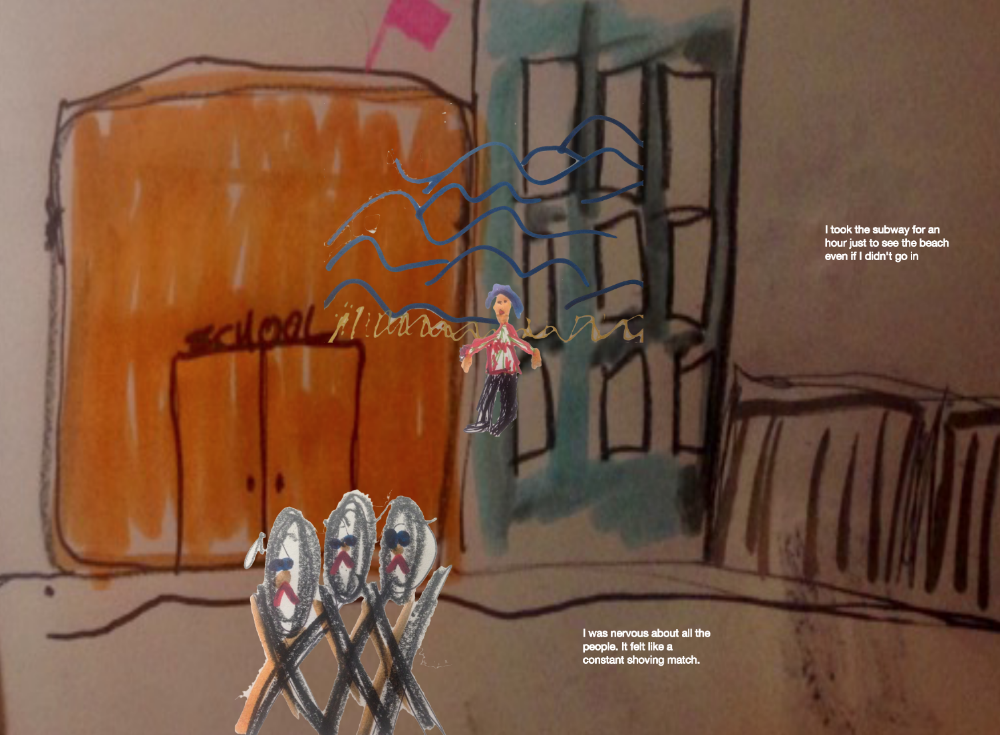

# P5-Flatgame

**Note: I am currently editing to make this more advanced so assets can be dropped in easier. Consider this the pre-alpha!**

This is a template to create a [Flatgame](https://flatgame.itch.io/) using the P5JS and P5Play javascript libraries under the hood.

## Glossary

### What is a FlatGame?

A [flatgame](https://flatgame.itch.io/) is an inclusive democratic form of game-making. Participants create games with paper, markers, crayons, photos, scissors in a cut and paste zine approach. Flatgames take the approach of creating a story about one's own life, , often a game about a place you've  been or a memory. All art is made by hand, usually with a single sheet of paper. You could also use clay, collage, paint, among many other options. The art assets are photographed and imported. There are previous templates for making a FlatGame in [Unity](https://candle.itch.io/flatpack). I have made a user-friendly editable template for P5JS with P5Play.



## Installed Dependencies - these come with P5-Flatgame

### P5JS

[P5JS](http://p5js.org) is a Javascript library with the goal of making coding accessible for artists, designers, educators, and beginners. It is a reinterpretation of [Processing](http://processing.org), by Casey Reas and Ben Fry, initiated by artist [Lauren McCarthy](http://www.lauren-mccarthy.com/).

### P5Play

[P5Play](https://molleindustria.github.io/p5.play/) is a Javascript library initiated by artist, game-maker [Paolo Pedercini](http://molleindustria.org/). It works with P5JS and is a Javascript library for the creation of *games and playthings*.


# How To Use This

1. Get a piece of paper, markers, crayons, scissors, glue, tape, etc.
2. Make a flatgame. Draw. Write. Create a game about a place or memory. Tell a story. Use any materials.
3. Snap photos of it all. Cut it up in Photoshop, GIMP, etc. Or take individual snaps of each item and the player.
4. Move player image files to the player assets folder. Note the filename scheme. Update the player animation section in ```sketch.js``` if you have more than 3 images for the player.
5. Replace the ```background.jpg``` image in the assets folder with your own background image. Gifs and png files are okay as well, but make sure you change this in ```sketch.js```.
6. Replace the items in the assets/items folder. Make sure you name this in sequential order. Update ```numOfItems``` in sketch.js to be equal to the number of files in here. Must be named in numerical order, ending in ```.jpg```.
7. Change the ```itemText``` array at the top of the sketch.js file with your own text. The order should match the order of the items in the ```assets/items``` folder.
8. Change the soundtrack. Delete my soundtrack file. Drop in another mp3 file, change its name to ```soundtrack.mp3```.
9. Test by running a local server. Edit. Iterate. Publish to the web!

### Flatgames rules

This comes from the [Flatgame Annual overview](https://itch.io/jam/flatgame-annual-2016).

> There are some rules to flatgames to make it easier 4 u.
> 1. Create works where you only control/play with movement of pieces around the screen (the player or anything else) and no further interaction, or even collisions. As little scripting as possible except movement and animation. Flat games are focused on presenting a game as the most raw and immediate combination of movement, art and sound. Place text onto the world to give characters dialogue, monologue and story.  
> 2. Make art physically, and try to complete it in under an hour or so. Use whatever materials you want! Pens and paper, crayon, photos of toys around your house or even puppets! Give yourself a time limit. Eg, 30 minutes to draw the elements you need and 30 minutes to edit and clean up, or even alter however you want. I love boosting the saturation to gaudy levels. For animation, try to draw the same thing twice. The art can be re-purposed. Use the things you already drew in ways you didn't think of at the time! Protip, if drawing, draw on the same a3 sheet as it will limit how much drawing you do!
> 3. No sound effects, just a single track of ambience/music/background. A track of music/sound is a great way to add structure and a sense of progression to your flatgame. Tools like audacity can be downloaded for free.  
> 4.n Release it! The idea is to aim to make the game in an hour or two, and to actually do it in half a day. Finishing games is its own skill and it's fun. <3 Remember most people's key impression of your game will be from your itch page, so add screenshots and give a nice description!!  
> (Bonus 0. Flat games should be inspired by or recreate real events and places. Feel free to exaggerate/reinterpret and fictionalize. Isle is Full of Noises started as a game about visiting an island for a holiday (inis spraoi!) when I drew the art, but when I put it into the game it became something entirely different and pulled from different memories.
> Think about how you can use the 2D canvas to represent space and time. Eg, to show time passing in one location, draw the location multiple times at different times and the playing can walk between them. Space as time. art as time. time as time!)

## Resources

**Highly recommended** [Pixels x Paper Zine](https://pixelsxpaper.itch.io/zine) with essays and inspiration for making Flatgames, printed in conjunction with the Pixels x Paper exhibit at [Babycastles](https://babycastles.com/Pixels-x-Paper) August 2018.

There is a [FlatGame Annual jam](https://itch.io/jam/flatgame-annual-2016). [Here](https://itch.io/jam/flatgame-annual-2017/entries) are a number of browser-playable Flatgames from the FlatJam 2017! The annual FlatJam is organized by llaura dreamfeel -check out her game [The Isle Is Full of Noises](https://dreamfeel.itch.io/the-isle) and [breogán hackett](https://boaheck.itch.io/).

Wonderful game-maker and tool-creator Mark Wonnacott created an [Android application](https://candle.itch.io/flatpack) to make FlatGames called Flatpack.

A [tutorial](https://flatgame.itch.io/first-timers-tutorial) for making Flatgames.

##### TODO

*Obvious next steps are to make this more robust so things are easier to drag and drop without having to play with variables or other code unless you want to peek under the hid. Then add publishing capability.*
